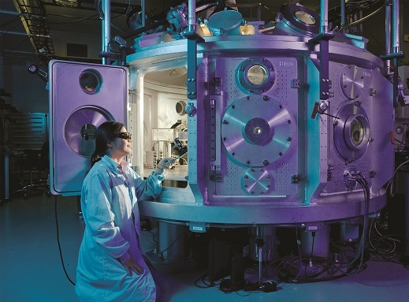

# Community_Science_Museum
Community science museum website 

An interactive science museum called the Community Science Museum is opening in your town/city. Its core target audience is primary and middle school children (ages 7-15) and families with young children. The museum wants an informative, appealing website to attract middle school pupils and their parents. The site should appeal to youngsters without pandering; it should take for granted that the audience is curious and intelligent. The website should be informative and engaging, encouraging viewers to visit the museum. The website should be responsive and easy to use on various devices.

You have been provided media assets as text and images (see link under Resources). It is for you to decide how these will be used in terms of presentation, hierarchy, and design.

Project Description
Based on the first-semester curriculum, the semester project should reflect the student’s creative and technical knowledge and skills. This includes design principles, project management, communication technology, and development with HTML/CSS.

Target Audience & Design: The target audience should be carefully considered, and the proposed design should reflect this. A website prototype should be made using your chosen software (Adobe XD, Figma etc.)

Final Product: A URL and zip file with the final website should be submitted. The site should be tested on a variety of devices before final delivery. The student is responsible for setting up their web host or using Netlify to deploy the site. GitHub repositories should be set to private.

Report: Submit a report discussing the design and technical aspects of the project, as well as how guidelines for WCAG, SEO and content management were handled. A template for this report is provided under ‘Resources’.

The duration of the Semester Project is four weeks (full-time) and eight weeks (part-time).

Requirements
The site must have a design that appeals to the target audience.
The site must have at least 4-6 pages.
Compositional principles, typography, and colour schemes must be considered.
Your HTML should be semantic and neatly indented.
The site should use external CSS style sheets which follow the DRY principle.
The site should download quickly and not be overly “heavy”. Images should be at most 200kb.
The site should consider WCAG principles, especially regarding hierarchy, navigation, and colour usage.
The site should be responsive, attractive, and easy to use on various devices.
The site should show consideration for content strategy and SEO (consider your use of meta tags and alt text).
The GitHub repo for the project should be set to private. You do not need to submit this with your project.
Submission
A link to the live version of the site must be submitted as ‘online text.’
A link to the site’s prototype must be submitted as ‘online text.’
A zip file of the whole project should be delivered.
A report must be included with the project delivery. Ensure the report is a PDF and follows the correct naming conventions. Please use the report template provided here.

Community Science Museum 

“Explore together” 

Come join us at the Community Science Museum where we’re committed to making science accessible to all. 

Over the course of human history, science has developed from our early understanding of fire, wind, water, and earth to exploring everything from galaxies far away to the very building blocks of life itself. 

The aim of our museum is to create a space where everyone can experience the wonders of our discoveries and perhaps even ignite a lifelong passion to continue the exploration of the world around us. 

We believe science should not be confined to the textbook, but brought to live through exhibits. This is why we have over 1000 different exhibits on the many varied subjects of science to explore. Many of these exhibits are designed for you to interact with and play around to see science come to life (apart from the dinosaur exhibits – they only come to life at night when everyone’s gone home). 

Explore 

For kids 

Are you a young person looking to learn more about science? Come on down to our museum, there’s plenty to see and do. 

You can learn about Newtonian physics from our bumper swing, or why not travel back in time and meet our resident Woolly Mammoth? Our exhibits are designed to be accessible for interested minds, so make sure you come ready to learn and explore. 

We also have the Young Stars club which meets once a week on a Saturday between 10:00 and 13:00 where you’ll get to explore and experiment with our team of experts. 

During the school holidays we run special holiday clubs where you can join other children your age to go on a journey of discovery. Each holiday we pick a new theme to explore. To find out more about the holiday club and how you can join, send us a message. 

For teachers 

As a community-driven museum, we want to work with schools to create places of learning and exploring. Our team are on hand to give your students guided tours of the museum, teach them in our learning laboratory, and provide great video presentations that will excite and inspire them. 

Please get in touch with us here to find out more about our facilities and to arrange a time to bring your students through for a visit. 

Researchers 

Are you looking to get involved with our team of researchers and academics? Our museum offers various ways for you to use our resources and contribute towards them. We have online records, laboratory space, and a working relationship with a number of universities around the country. 

Exhibition Spaces 

Cosmology 

Explore the wonders of our cosmos. Our fantastic exhibition, ‘The Sky Above Us’, explores the night sky and what we can see and know about the universe around us. We’ll locate the various constellations and galaxies that can be seen and learn a bit about the early navigators who used the stars to travel by. 

Follow the journey of our solar exploration: from early Arab traders, to Galileo’s telescope, to the latest exploration of the planets in our solar system. 

Evolution 

For centuries, philosophers and scientists have wrestled with the question of our origins. Where do we come from and how did we get here? Since Darwin proposed his theory of evolution we have had a framework for exploring and understanding our place in this world. 

Discover the origins of life on this planet and how the species we know today have evolved our time. You can also take some time to meet a few of the creatures who didn’t survive, including our Woolly Mammoth, the Dodos, and a number of dinosaurs too. 

Biology and Medicine 

From micro-organisms to the human body, major breakthroughs in biology are offering us unique insights into the great wonders of the tiny world.  

For many people their life expectancy is much longer and their quality of life much improved, thanks to the growth of our understanding of medicine. Over a series of exhibits we explore the history of medicine and take a look at some major breakthroughs including the discovery of penicillin and the first heart transplant.  

Many of our great medicinal discoveries have come not only from the lab, but also from observing animals in the wild. Often our fellow creatures have beat us to it. 

Robotics and AI 

The information revolution is here and robotics and artificial intelligence are the science of the future. From useful home applications of AI to industrial uses of robotics, the future is here. You can even say hello and shake the hand of Rob the Robot. 

Ecology 

As we learn more and more of the impact humans are having on the planet, the more important it becomes that scientists explore how to create a sustainable future not just for humans but for the whole planet. 

In our ecology section of the museum, we unpack the dangers we currently face including global warming, extinction of species, and pollution. But we also focus on the positive ways we can all contribute to a brighter future. 

 

Special Events and Exhibitions 

News 

Visiting Professor of Aeronautics 

It is our pleasure to announce that Prof Sheila Widnall from the Massachusetts Institute of Technology will be delivering 3 lectures on the development of aeronautics and where the future lies in this exciting ‘space’. 

Night in the Museum 

Get your family together for an exciting night in the museum as you sleep over beside dinosaurs and science displays. Bring your own sleeping bag and get ready to rough it as we go exploring the wonders of science. 

Energetica Exhibition on Loan 

On loan from the NEMO Science Museum in Amsterdam, the Energetica exhibition is coming to the Community Science Museum. It’s a series of installations that allow visitors to experience the power of the elements as we harness them. From solar energy powering lighting, to ‘Wind Island’ that shows how turbines are able to use and control wind to create power. 

Visit 

Location 

The museum is located at [student to include address]. 

Admission 

The entrance is free for all.  

There are guided tours of the museum that leave every hour. These tours are 70 NOK per person and include a handy printed guide of the museum.  

If you would like to organise a guided tour for your group of 6 or more people, please contact us to arrange the tour. 

Hours 

Monday: Closed 

Tuesday: 10:00 – 16:00 

Wednesday: 10:00 – 16:00 

Thursday: 10:00 – 16:00 

Friday: 10:00 – 19:00 

Saturday: 9:00 – 16:00 

Sunday: 9:00 – 13:00 

Accessibility 

The museum has wheelchair accessibility ramps. It also has audio guides and braille display signs for the visually impaired. 

Food and drink 

There is a café attached to the museum where you can get light lunches, soft drinks, coffee, snacks and more. 

Shop 

Our shop offers a range of memorabilia from the museum as well as great gifts and activity packs that allow you to continue to explore science even after you’ve left the museum. 

 

Get Involved 

Support  

There are various ways you can support the museum. Donations are very welcome and are an important way we keep this museum open and accessible to the whole community.  

You can also support us by donating items of interest to the museum’s collections. If you have some item or collection that you think others would enjoy, please let us know by contacting our Collections Department and they will be able to assist you. 

Volunteer 

A number of people volunteer their time and effort to keep the displays in good order and ready for visitors to come and enjoy. Volunteering has its perks including getting to see behind the scenes of a working museum, access to staff-only lectures, and a monthly lunch where all staff and volunteers come together to discuss ideas for future exhibits and strategies for the museum. 

You can help volunteer in a number of different spheres. Please contact us if you’d like to find out more about how you can get involved. 

Internships 

Are you interested in working in a museum? Do you enjoy the fun and excitement of sharing the wonders of nature with people? Well you could be just the right person to enjoy an internship at the museum. 

You’ll be learning from a number of different academics and people who are passionate about science and sharing it with the wider community. 

.hide_list {
    display: flex;
    flex-direction: column;
}
.hamburger_list{background-color: yellow}
#menu_checkbox,.hide_list{display: ;
}
#menu-checkbox:checked~.hamburger_list{ background-color: red;}  
#menu-checkbox:checked~.hide_list{ background-color: blue;}  
footer{
    background-image: url(/Images/footer.jpg);
    height: fit-content;
}

@media (max-width: 1000px) {

    header>nav{
        font-size: 1.8em;
       gap: 20px;
       margin-right: 5px;
    }
    .LOGO {
        max-height: 110px; 
        display: flex;
       }
}

@media (max-width: 820px) {
    footer{display: none;}

    .menu_top{
    display:none    
}
}

      

                <a href="#">
                
                
Young Stars Club
</a>
            

             

                <a href="exhibition_Spaces.html">
                
                
Exhibition spaces
</a>
            
