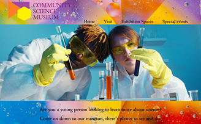

# Community Science Museum 



Community Science Museum Webpage

## Description

an informative, appealing website to attract middle school pupils and their parents.

- Core target: audience is primary and middle school children (ages 7-15) and families with young children
- For: kids, teachers, Researchers and parents. 
- Exhibition Spaces: Bioligy, Cosomology, Ecology, Evelution, Robotics, Lego
- Special Events and Exhibitions


## Built With
- HTML
- CSS


## Getting Started

### Installing


1. Clone the repo:

```bash
git clone: https://github.com/IceGreenGalactic/Community_Science_Museum.git
```

2. Install the dependencies:

```
npm install
```

### Running


To run the app, run the following commands:

```bash
npm open index with "open with live server" or Alt+L Alt+O
```


## Contact

[My LinkedIn page](https://www.linkedin.com/in/kristine-tyrholm-7902172a4)


## Acknowledgments
Thanks to fellow students who have given feedback and shared their own sites and visdom 